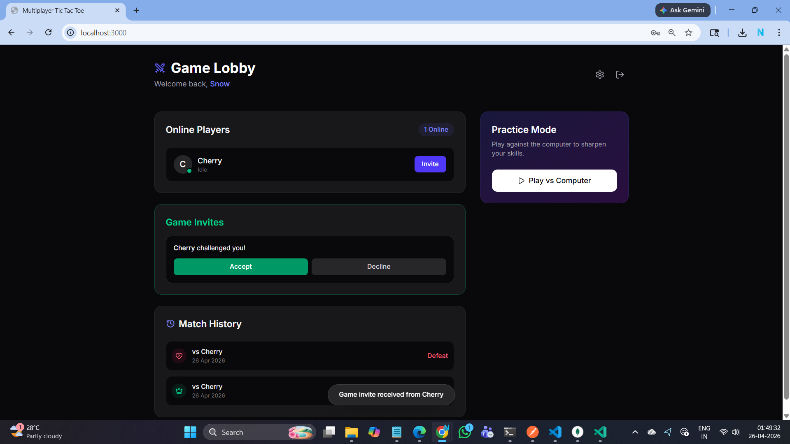
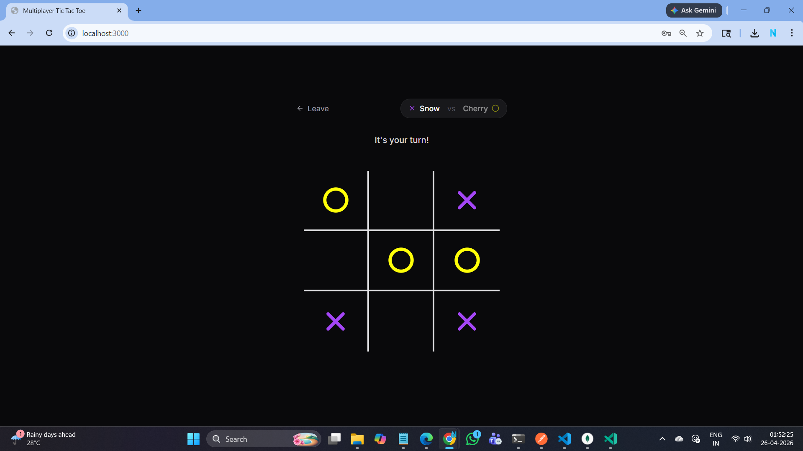
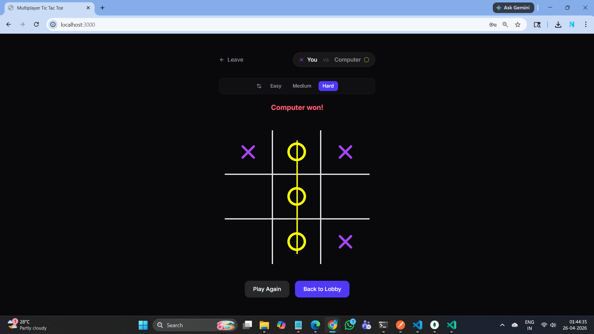
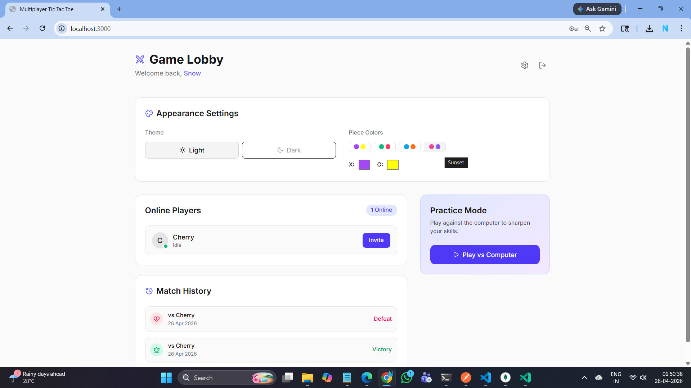

# Multiplayer Tic Tac Toe

<p align="center">
  A real-time multiplayer Tic Tac Toe game built with <strong>React</strong>, <strong>TypeScript</strong>, <strong>Express</strong>, <strong>Socket.IO</strong>, and <strong>MongoDB</strong>.
</p>

<p align="center">
  
</p>

---

## Features

| Feature | Description |
|---|---|
| **Real-time multiplayer** | Challenge any online player via live Socket.IO invitations |
| **Lobby system** | See who's online, send/accept/decline invites with a cooldown timer |
| **Match history** | View your last 10 games with full board snapshot replay |
| **vs Computer** | AI Practice mode with Easy / Medium / Hard modes |
| **Customisation** | Toggle dark/light mode, pick X/O piece colors from presets or custom |
| **Toast notifications** | Non-intrusive toasts for invites, moves, and errors |
| **Persistent accounts** | Username + password in MongoDB; reconnect from any browser session |

---

## Screenshots

### Live Multiplayer Game

<p align="center">
  
</p>

Real-time board with animated piece placement, turn indicator, and a winning-line SVG overlay.

---

### vs Computer = Practice Mode

<p align="center">
  
</p>

Three difficulty levels: **Easy** (random), **Medium** (mixed), **Hard** (unbeatable).

---

### Theme & Colour Customisation

<p align="center">
  
</p>

Switch between dark and light mode and choose from four colour presets (or pick your own) for X and O pieces.

---

## Tech Stack

| Layer | Technology |
|-------|-----------|
| Frontend | React 19, TypeScript, Tailwind CSS v4, Framer Motion, Lucide React |
| Backend | Node.js, Express, Socket.IO |
| Database | MongoDB via Mongoose |
| Build | Vite |
| Runtime | tsx (TypeScript execution for Node) |

---

## Folder Structure

```
.
├── index.html               # HTML entry point
├── vite.config.ts           # Vite configuration
├── tsconfig.json            # TypeScript configuration
├── .env.example             # Environment variable template
├── assets/                  # Screenshots & static assets
├── server/                  # Backend (Node.js / Express / Socket.IO)
│   ├── index.ts             # Entry point = HTTP, Vite middleware, DB connect
│   ├── models/
│   │   ├── User.ts          # Mongoose User schema & model
│   │   └── Game.ts          # Mongoose Game schema & model
│   └── socket/
│       └── handlers.ts      # All Socket.IO event handlers
└── src/                     # Frontend (React / TypeScript)
    ├── main.tsx             # React entry point
    ├── App.tsx              # Root component = view routing & global state
    ├── index.css            # Global styles (Tailwind + fonts)
    ├── types/
    │   └── index.ts         # Shared interfaces (UserType, GameState, GameHistory, Theme)
    ├── hooks/
    │   └── useSocketEvents.ts  # Custom hook = Socket.IO listener lifecycle
    ├── lib/
    │   └── socket.ts        # Socket.IO client instance
    └── components/
        ├── Login.tsx        # Login / register form
        ├── Lobby.tsx        # Players list, invitations, match history, settings
        ├── Game.tsx         # Live multiplayer game board
        ├── ComputerGame.tsx # vs-Computer board with AI
        └── Toast.tsx        # Toast notification component
```

---

## Getting Started

### Prerequisites

- Node.js 18+
- A MongoDB Atlas cluster (or any MongoDB instance)

### Installation

1. Clone the repository and install dependencies:

   ```bash
   git clone https://github.com/nelay04/Multiplayer-Tic-Tac-Toe.git
   cd Multiplayer-Tic-Tac-Toe
   npm install
   ```

2. Copy the environment template and fill in your values:

   ```bash
   cp .env.example .env
   ```

   Edit `.env`:

   ```env
   MONGODB_URI=mongodb+srv://<username>:<password>@<cluster>.mongodb.net/tic_tac_toe?retryWrites=true&w=majority
   PORT=3000
   NODE_ENV=development
   ```

### Running in Development

```bash
npm run dev
```

The server starts on <http://localhost:3000>. Vite serves the React frontend with HMR through the same port.

### Running in Production

```bash
npm run build   # build the React frontend into dist/
npm run start   # serve the built frontend + API on PORT
```

---

## Available Scripts

| Script | Description |
|--------|-------------|
| `npm run dev` | Start dev server with Vite HMR |
| `npm run build` | Build frontend for production |
| `npm run start` | Run production server |
| `npm run lint` | Type-check without emitting |
| `npm run clean` | Remove the `dist/` folder |

---

## Environment Variables

| Variable | Required | Default | Description |
|----------|----------|---------|-------------|
| `MONGODB_URI` | Yes | = | Full MongoDB connection string |
| `PORT` | No | `3000` | Port the HTTP server listens on |
| `NODE_ENV` | No | `development` | Set to `production` to serve the static build |
